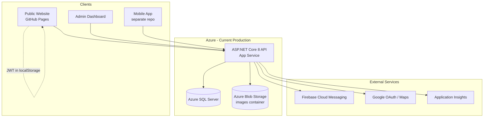
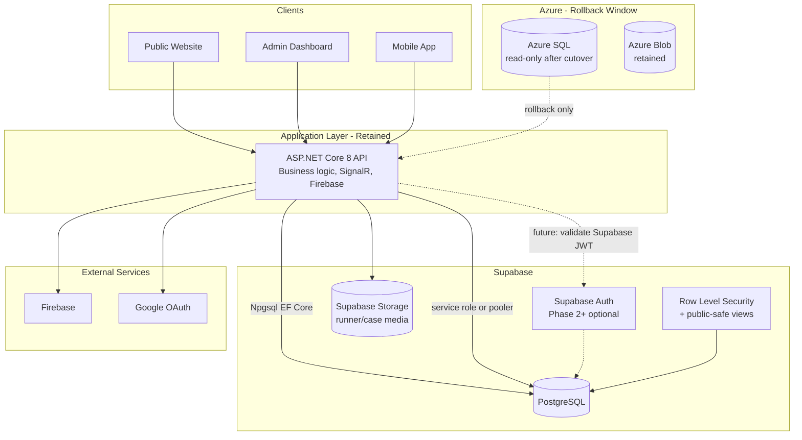
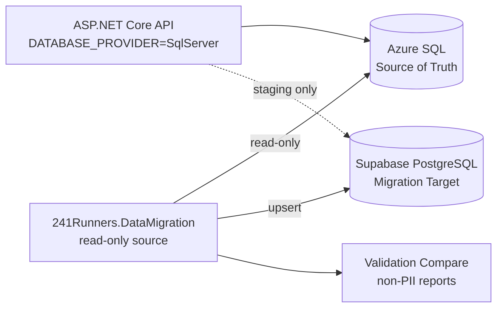

# ADR-001: Supabase Migration for 241RunnersAwareness.org

**Status:** Proposed  
**Date:** 2026-07-26  
**Decision makers:** MANUAL CONFIRMATION REQUIRED (project stakeholders)  
**Authors:** Migration engineering (Codex Phase 0)

---

## Context

241RunnersAwareness.org operates a static public website and admin dashboard on GitHub Pages, with an ASP.NET Core 8 API on Azure App Service backed by Azure SQL Server and Azure Blob Storage. The platform manages missing-runner cases, sensitive medical and location data, multi-role users, push notifications (Firebase), and real-time updates (SignalR).

A migration to Supabase is requested to modernize data infrastructure while preserving security, rollback capability, and application behavior. **Production Azure resources must remain intact until explicit cutover approval.**

Repository inspection findings are documented in [`docs/migration/repository-inventory.md`](../migration/repository-inventory.md).

---

## Existing Architecture

**Key facts from code audit:**

- 8 EF Core entities, integer PKs, SQL Server–only migrations
- Custom JWT + BCrypt auth (not ASP.NET Identity)
- OAuth via custom controller (Google, Apple, Microsoft)
- No separate tables for sightings, emergency contacts, or audit logs
- Sightings stored as JSON in `Cases.AdditionalInformation`
- Roles stored as string + JSON on `User`, not normalized `user_roles` table

---

## Target Architecture (Recommended)

**Recommendation: Option 3 variant — ASP.NET Core API + Supabase PostgreSQL + Supabase Storage, with phased Supabase Auth evaluation**

### Temporary Migration Architecture (Dual-Run Period)

During dual-run:

- **Azure SQL remains production source of truth**
- Migration tool copies data to Supabase (initial + delta)
- Staging API can run against PostgreSQL for validation
- **No uncontrolled dual writes**

---

## Decision: What Moves to Supabase

| Component | Decision | Rationale |
|-----------|----------|-----------|
| **PostgreSQL database** | **Move** | Primary migration goal; EF Core supports Npgsql |
| **Blob/file storage** | **Move** | `BlobImageStorageService` is isolated; map to Supabase Storage buckets |
| **Supabase Auth** | **Defer to Phase 2+** | BCrypt hashes incompatible with Supabase; custom JWT works today; migration requires password-reset campaign |
| **ASP.NET Core API** | **Retain** | SignalR, Firebase, complex authorization, public DTO logic, OAuth verification |
| **SignalR hubs** | **Retain in API** | Not a Supabase native replacement |
| **Firebase push** | **Retain** | Already integrated; independent of database |
| **GitHub Pages frontend** | **Retain hosting** | No change required for DB migration |
| **Azure App Service** | **Retain until cutover** | Rollback target |

---

## Why Supabase

1. **Managed PostgreSQL** with migrations in source control
2. **Storage** with RLS-aligned policies for media
3. **Auth** available when ready (not required day one)
4. **Row Level Security** for defense-in-depth if clients ever query Postgres directly
5. **Cost and operational simplicity** vs. self-managed SQL Server (MANUAL CONFIRMATION REQUIRED — stakeholder cost analysis)

---

## Why the ASP.NET Core API Is Retained

1. **Existing API contract** — 18 controllers, mobile and web clients depend on current routes
2. **SignalR** — Real-time admin/user notifications
3. **Firebase integration** — Push notification pipeline
4. **Custom OAuth flow** — Google/Apple/Microsoft verification logic
5. **Public-safe data projection** — `PublicCasesController`, `PublicCaseHelpers` enforce privacy rules in application code
6. **Rate limiting, CSRF, input sanitization** — Middleware already implemented
7. **Minimizes client churn** — Frontend/mobile can keep calling same API URL during transition

Supabase client libraries may be added to frontend **only** for future Auth or Storage direct access after security review. Initial cutover does **not** require client-side Supabase SDK.

---

## Authentication Strategy

### Phase 1 (Database migration)

- **Keep existing custom JWT** issued by `AuthController`
- API connects to Supabase PostgreSQL via Npgsql using a **restricted database role** (not service role in request path)
- Create `identity_migration_map` table for future Supabase Auth linking
- **Do not import BCrypt hashes into Supabase Auth**

### Phase 2 (Optional auth cutover)

- Create Supabase Auth users via **server-side invitation/password-reset flow**
- Map `User.Id` (int) ↔ `supabase_user_id` (uuid) in `identity_migration_map`
- API validates Supabase JWT (`iss`, `exp`, signature) **in addition to** or **replacing** custom JWT
- Google OAuth reconfigured in Supabase Auth console; account linking rules documented in `auth-migration-plan.md`

---

## Authorization Strategy

| Layer | Responsibility |
|-------|----------------|
| **ASP.NET Core** | Primary authorization — role checks, case ownership, `IsPublic` filtering |
| **PostgreSQL RLS** | Defense-in-depth; required if PostgREST/Supabase client direct access is enabled |
| **Public views** | `public_cases_v`, `public_map_points_v` — column allowlist only |
| **Storage policies** | Bucket-level; private by default; signed URLs for authorized access |

Roles in application: `user`, `parent`, `caregiver`, `therapist`, `adoptiveparent`, `admin` (+ `AdditionalRoles` JSON).

---

## Storage Strategy

| Azure (current) | Supabase (proposed) |
|-----------------|---------------------|
| Container: `images` | Buckets: `runner-public-photos`, `runner-private-photos`, `case-documents`, `sighting-media`, `user-avatars`, `temporary-uploads` |
| URLs in `Runner.ProfileImageUrl`, `Case.CaseImageUrls` | Update via `migration_file_map` after upload |
| SAS tokens via `ImageUploadController` | Supabase signed URLs via API |

**Private buckets default.** Public photos only when case/runner is explicitly public.

---

## Migration Strategy

1. **Phase 0–1:** Discovery, backup, read-only audit (no production changes)
2. **Phase 2–3:** Local/staging Supabase, schema migrations, RLS design
3. **Phase 4–5:** .NET migration tool, dry-run, synthetic staging migration
4. **Phase 6:** Blob inventory and staged file transfer
5. **Phase 7:** Dual `DATABASE_PROVIDER` in API (`SqlServer` | `Postgres`)
6. **Phase 9–10:** Staging E2E + production rehearsal on isolated backup
7. **Phase 11:** Cutover with write freeze, final delta, switch provider
8. **Phase 12:** Observation period; Azure retained read-only

**ID preservation:** Integer PKs preserved (`Users.Id`, `Runners.Id`, etc.) to avoid breaking FKs and API contracts.

---

## Rollback Strategy

| Trigger | Action |
|---------|--------|
| Auth failure spike | Revert `DATABASE_PROVIDER=SqlServer`; redeploy last stable API |
| Data integrity failure | Stop writes; restore API to Azure SQL; reconcile delta |
| RLS exposure | Disable Supabase public access; revert to API-only |
| File migration failure | API continues serving Azure Blob URLs from DB |

**Azure SQL and Blob data are not deleted during rollback.** Supabase data preserved for forensics.

Detailed steps: `docs/migration/rollback-runbook.md` (to be created in Phase 10).

---

## Risks

| Risk | Severity | Mitigation |
|------|----------|------------|
| PII exposure via RLS misconfiguration | **Critical** | Policy matrix + automated deny tests |
| BCrypt → Supabase Auth incompatibility | High | Phased auth; password reset campaign |
| Sightings in JSON column | Medium | Migrate as-is first; normalize in Postgres v2 if needed |
| Azure Blob URL breakage | High | `migration_file_map`; atomic URL update transaction |
| No automated tests today | High | Build migration + integration tests before cutover |
| Auto-migrate on API startup | High | Disable for Postgres production; explicit migration CLI |
| Mobile app separate repo | Medium | Document contract; coordinate release |
| Integer PK vs Supabase Auth UUID | Medium | `identity_migration_map` bridge table |
| SQL Server → Postgres query differences | Medium | `ef-core-provider-compatibility.md`; integration tests |
| Coordinate precision on public map | **Critical** | Audit `MapController`; generalize public coordinates |

---

## Alternatives Considered

| Option | Verdict |
|--------|---------|
| **1. API + Supabase PostgreSQL only** | Viable minimum; chosen as Phase 1 target |
| **2. API + Supabase Auth + PostgreSQL** | Deferred — auth migration is high-risk for users |
| **3. API + Auth + PostgreSQL + Storage** | **Recommended end state** after phased rollout |
| **4. Hybrid Azure/Supabase during transition** | **Required** during dual-run validation |
| **5. Full Supabase replacement (no API)** | **Rejected** — loses SignalR, Firebase, existing API contract, complex business logic |
| **6. Stay on Azure SQL** | Status quo; does not meet migration goal |

---

## Final Recommendation

**Adopt a phased hybrid migration:**

1. **Immediate:** Document, backup, audit (no production changes)
2. **Build:** Supabase PostgreSQL schema + migration tool + dual EF provider
3. **Validate:** Staging migration with synthetic data; RLS and public view tests
4. **Cutover:** Switch API `DATABASE_PROVIDER` to Postgres; migrate blobs; keep Azure as rollback
5. **Later:** Evaluate Supabase Auth after user communication plan approved

**Do not enable Supabase Auth or direct client database access until RLS policies pass security review.**

---

## Consequences

### Positive

- Version-controlled PostgreSQL migrations
- Potential cost reduction (MANUAL CONFIRMATION REQUIRED)
- Modern storage with policy-based access
- Foundation for future Supabase Auth and realtime features

### Negative

- Significant engineering effort (migration tool, dual provider, tests)
- User auth migration complexity if Supabase Auth adopted
- Operational complexity during dual-run period
- Two databases to maintain until Azure decommission approved

---

## Approval

| Role | Name | Date | Approved |
|------|------|------|----------|
| Technical lead | MANUAL CONFIRMATION REQUIRED | | ☐ |
| Security | MANUAL CONFIRMATION REQUIRED | | ☐ |
| Product / stakeholder | MANUAL CONFIRMATION REQUIRED | | ☐ |

---

## References

- [`docs/migration/repository-inventory.md`](../migration/repository-inventory.md)
- [`docs/migration/MIGRATION_PROGRESS.md`](../migration/MIGRATION_PROGRESS.md)
- [`PUBLIC_API_SPEC.md`](../../PUBLIC_API_SPEC.md)
- [`241RunnersAPI/API_CONFIG.md`](../../241RunnersAPI/API_CONFIG.md)
