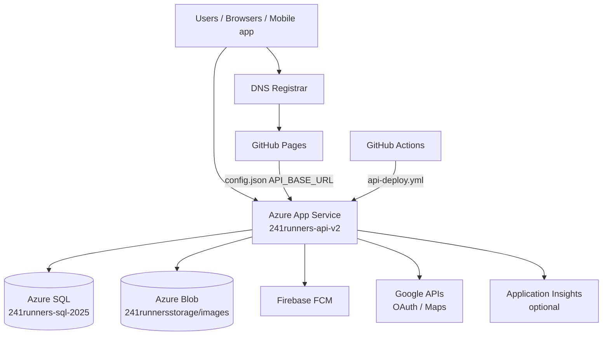

# Production Dependencies

**Last updated:** 2026-07-26  
**Purpose:** Inventory of production services the platform depends on, for migration planning and rollback.

---

## Dependency Map

---

## Critical Path Services

| Service | Provider | Identifier | Migration impact |
|---------|----------|------------|------------------|
| Public website | GitHub Pages | `www.241runnersawareness.org` | Low — `config.json` only for API URL |
| REST API | Azure App Service | `241runners-api-v2.azurewebsites.net` | High — DB provider switch |
| Relational DB | Azure SQL | `241runners-sql-2025` | **Replaced by Supabase PostgreSQL** |
| File storage | Azure Blob | `241runnersstorage` / `images` | **Replaced by Supabase Storage** |
| CI/CD (site) | GitHub Actions | `pages.yml` | Low |
| CI/CD (API) | GitHub Actions | `api-deploy.yml` | Medium — add Postgres secrets |
| DNS | External registrar | MANUAL CONFIRMATION REQUIRED | Low until API domain change |

---

## Authentication Dependencies

| Component | Technology | Config source |
|-----------|------------|---------------|
| API JWT | HMAC-SHA256 symmetric | `JWT_KEY`, `JWT_ISSUER`, `JWT_AUDIENCE` |
| Password hashing | BCrypt | Application code |
| Google OAuth | Custom token verify | `OAuthController` — client IDs MANUAL CONFIRMATION REQUIRED |
| Apple / Microsoft OAuth | Custom | `OAuthController` |
| Client token storage | `localStorage` | Multiple keys — see inventory |

**Supabase Auth:** Not in production today.

---

## Notification Dependencies

| Channel | Implementation | Status |
|---------|----------------|--------|
| Push (mobile) | Firebase Cloud Messaging | `FIREBASE_SERVICE_ACCOUNT_JSON` on App Service |
| Email | Stub `EmailService` | Logs only — SendGrid not integrated |
| SMS | Not implemented | Mentioned in privacy policy only |
| Real-time (web) | SignalR hubs | Hosted in API |

---

## External API Dependencies

| API | Used by | Config |
|-----|---------|--------|
| Google userinfo | OAuth login | Runtime HTTP call |
| Google Maps | Frontend / mobile | `config.json` `EXPO_PUBLIC_GOOGLE_MAPS_API_KEY` |
| Firebase | Push notifications | Service account JSON |

---

## GitHub Secrets (names only)

| Secret | Consumer |
|--------|----------|
| `AZURE_SQL_CONNECTION_STRING` | API deploy, restore scripts |
| `JWT_KEY` | API deploy |
| `AZURE_WEBAPP_NAME` | API deploy |
| `AZURE_CREDENTIALS` | API deploy (service principal) |
| `AZURE_WEBAPP_PUBLISH_PROFILE` | Legacy Kudu deploy |
| `AZUREAPPSERVICE_*` | Legacy OIDC (azure-restore.yml) |

**Future Supabase secrets (not yet created):** `SUPABASE_URL`, `SUPABASE_ANON_KEY`, `SUPABASE_SERVICE_ROLE_KEY`, `SUPABASE_DB_CONNECTION_STRING` — staging only until cutover approval.

---

## Health and Rollback Verification

| Endpoint | Expected | Status 2026-07-26 |
|----------|----------|-------------------|
| `https://www.241runnersawareness.org/` | HTTP 200 | **200** (site up) |
| `https://241runners-api-v2.azurewebsites.net/api/v1/auth/health` | HTTP 200 | **403** (App Service disabled) |
| `https://241runners-api-v2.azurewebsites.net/readyz` | HTTP 200 | **403** |

**Rollback capability:** Azure SQL and Blob data presumed intact but **API is not serving**. Subscription is **disabled**. Rollback procedure documented in `azure-backup-and-recovery.md`; live verification BLOCKED until Azure resources are re-enabled.

---

## Rollback Source of Truth (current)

| Layer | Rollback source |
|-------|-----------------|
| Frontend | Git tag on `main` + GitHub Pages redeploy |
| API | Last successful `api-deploy.yml` artifact / git tag |
| Database | Azure SQL (no switch yet) + BACPAC backup |
| Files | Azure Blob `images` container |
| Auth | Existing JWT + BCrypt users in Azure SQL |

---

## Manual Confirmations

- [ ] DNS registrar login and zone export
- [ ] Firebase project ownership and service account rotation plan
- [ ] Google Cloud OAuth client IDs (web, iOS, Android)
- [ ] Mobile app repository and release pipeline
- [ ] Azure subscription re-enablement owner

---

## Related Documents

- [`repository-inventory.md`](./repository-inventory.md)
- [`azure-backup-and-recovery.md`](./azure-backup-and-recovery.md)
- [`azure-sql-audit.md`](./azure-sql-audit.md)
